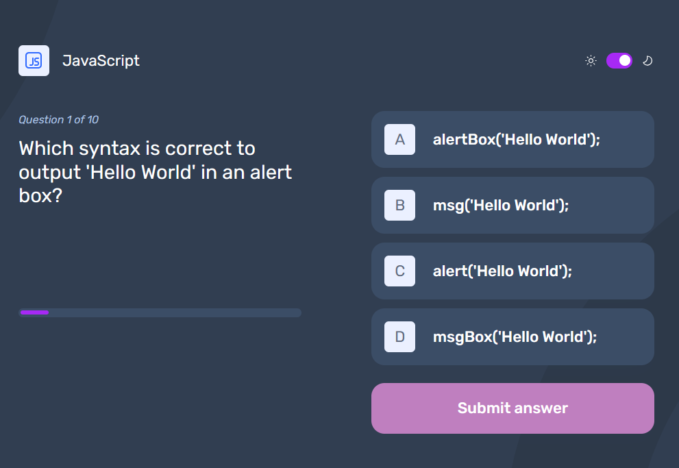
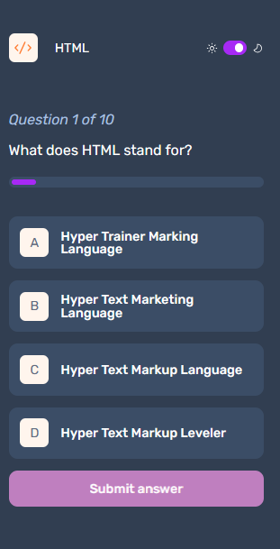

# Password Generator App

A web application of a frontend quizz. The user selects a topic and a series of 10 questions is displayed. For each one, the user can select an answer and, after submitting the answer
the correct option is displayed (and also if the selected option is not correct).
This application is responsive and usage local storage to store the user's theme preferences.

## Practice and reinforce:
- Responsive design
- DOM manipulation
- Clean and maintanable code
- Local Storage
- Theme management
- OOP

## Technologies:
- HTML5
- CSS3
- Vanilla Javascript

## Main features:
-  Allows user to select a frontend related topic
-  Displays:
    - The correct answer for each questions after submitting the selected option

## How to use
1. Select a topic
2. Naviage through the topic's questions
3. Select your answer from the given options
4. Click 'Submit' button.

## **Desktop preview:**

## **Mobile preview:**

## Live site url:
https://cf-fequizz.netlify.app/